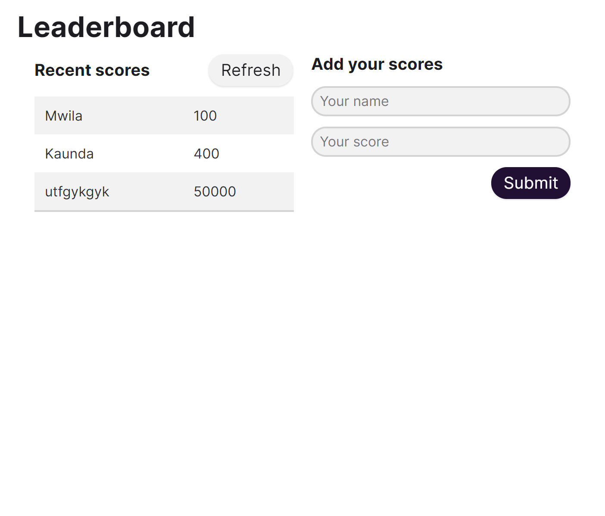

# lboard

In this project, I have built a web app powered by the Leaderboard APIs. I've achieved by using the Webpack Framework.

## Live Link

# Coming soon!

## Project Requirements

Implement only a basic UI with plain HTML:

## Install

- [Download](Clone the repository to your machine)

- $ git clone https://github.com/softwareengineermwi/lboard/tree/dev

- run npm install or npm i for installing necessary packages for running the app.
- run npm run build for building the code files to the dist dir.
- run npm run start for the local host.

## Built With

- JavaScript
- HTML
- CSS
- Webpack

## Dependencies

> Refer to [Linters Config](https://github.com/softwareengineermwi/linters-config) for dependencies setup guide.

## 👤 Authors

- Github: [@softwareengineermwi](https://github.com/softwareengineermwi)
- Twitter: [@swengineermwi](https://twitter.com/swengineermwi)
- Linkedin: [Mwila Kaunda](https://www.linkedin.com/in/mwila-kaunda-5479b2168)

## Show your support

Give a ⭐️ if you like this project!
